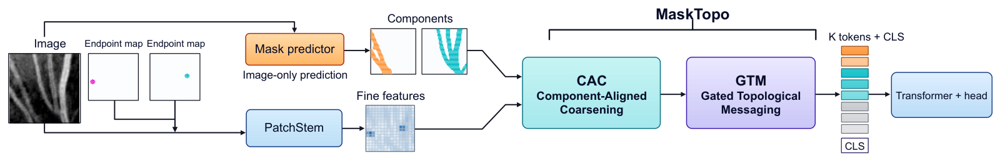
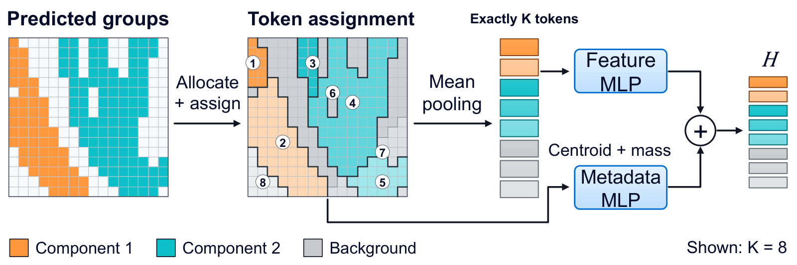
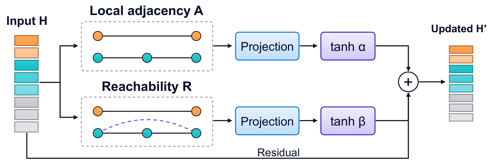

# MaskTopo

**English** | [简体中文](README.zh-CN.md)

**Component-Aligned Token Coarsening for Thin-Structure Connectivity**

Companion code for the manuscript **MaskTopo: Component-Aligned Token Coarsening for Thin-Structure Connectivity**.

**Authors:** Taowei Ye<sup>1*‡</sup>, Zi Yi Zou<sup>2*</sup>, Yutong You<sup>1</sup>

<sup>1</sup> East China Jiaotong University · <sup>2</sup> University of Waterloo

<sup>*</sup> Taowei Ye and Zi Yi Zou contributed equally.

<sup>‡</sup> Corresponding author: Taowei Ye.

MaskTopo organizes dense visual features into exactly **K nonempty tokens** using predicted connected components, then propagates information through separately gated **adjacency** and **reachability** branches.



## Method

- **CAC — Component-Aligned Coarsening:** allocate tokens across retained components, partition each group, and pool appearance features with centroid and support-size metadata.
- **GTM — Gated Topological Messaging:** combine row-normalized adjacency and reachability messages with independent gates and a residual connection.
- **Connectivity head:** a two-layer, four-head Transformer predicts whether two marked endpoints are connected.

The classifier input is `[B, 3, 64, 64]`: one image channel and two endpoint maps. The image-only mask predictor supplies structural probabilities. **Annotation masks supervise training and define labels; they are not inference inputs.**

<details>
<summary>Module diagrams</summary>





</details>

## Installation

```bash
git clone https://github.com/taoweiye48-pixel/MaskTopo.git
cd MaskTopo
python -m venv .venv
# Linux/macOS: source .venv/bin/activate
# Windows PowerShell: .\.venv\Scripts\Activate.ps1
python -m pip install --upgrade pip
python -m pip install -e .
```

For the original experiment drivers:

```bash
python -m pip install -e ".[experiments]"
```

Release verification used Python **3.12.10**, PyTorch **2.11.0+cu128**, NumPy **2.3.5**, and SciPy **1.16.1**. Core tests run on CPU. Select a PyTorch build appropriate for your machine. See [the recorded environment](requirements-tested.txt).

## Quick start

```bash
python examples/smoke_demo.py
python -m pip install -e ".[test]"
python -m unittest discover -s tests -v
```

The demo uses synthetic inputs and random weights to check the interface; it does not reproduce trained accuracy. The tests check exact token counts, component boundaries, reachability, zero-initialized gates, checkpoint compatibility, and numerical parity with the original implementation.

### Use with predicted masks

```python
import torch
from masktopo import MaskTopo, MaskPredictor, build_topology

model = MaskTopo(token_count=8, dim=64).eval()
predictor = MaskPredictor().eval()
# Load trained state dictionaries into both modules before real evaluation.

images = torch.rand(2, 3, 64, 64)  # Replace with image + endpoint-map inputs.
with torch.no_grad():
    probabilities = predictor(images[:, :1]).sigmoid().squeeze(1)
    topology = build_topology(
        probabilities,
        token_count=8,
        threshold=0.5,       # Example only; select on development data.
        closing_iterations=0,
    )
    logits = model(images, *topology.tensors(device=images.device))
    connected_probability = logits.sigmoid()
```

`MaskTopo` has **149,123 classifier parameters** at `dim=64` for both K=8 and K=16. This count excludes the separate mask predictor. The public model preserves the original classifier state-dictionary keys. `build_topology` accepts NumPy arrays or detached tensors and performs hard CPU component assignments.

## Reported endpoint-connectivity results

The current manuscript is the authoritative source for all reported results. Three-seed mean balanced accuracy (BA, %), under its primary protocols:

| Dataset | K | MaskTopo BA | Primary comparator | Comparator BA | Gain (pp) |
|---|---:|---:|---|---:|---:|
| FIVES | 8 | 89.36 ± 2.79 | TokenLearner | 54.61 | +34.75 |
| DeepCrack | 16 | 74.97 ± 2.60 | Mask-Perceiver | 66.78 | +8.19 |
| Massachusetts Roads | 8 | 76.94 ± 0.76 | Matched G2TM | 67.14 | +9.80 |
| RootNav2 Brassica | 16 | 89.14 ± 0.81 | Mask-Slot | 69.53 | +19.61 |

These are **endpoint-connectivity classification** results. The comparators and evaluation protocols differ by domain. DeepCrack's primary result uses matched float16-stored mask probabilities; the historical float32 ablations are a separate experiment. The Massachusetts and Brassica correspondence ablations use post hoc development data. See [protocol distinctions](docs/reproduction.md) and [Tables 1-4 in CSV format](reported_results/README.md).

## Reproduce the experiments

Start with [data preparation](docs/datasets.md), then follow [the experiment guide](docs/reproduction.md).

The repository contains the original experiment scripts and protocol documents. Datasets, full sample caches, and trained checkpoints must be obtained or generated separately. The release does not claim that full training was rerun when packaging the code.

| Location | Contents |
|---|---|
| `masktopo/` | Installable CAC, GTM, classifier, and mask-predictor API |
| `experiments/` | Original training, evaluation, ablation, data-preparation, and summary scripts |
| `examples/` | Small executable interface demo |
| `tests/` | Structural invariants and original-implementation parity tests |
| `reported_results/` | Aggregate results transcribed from manuscript Tables 1-4 |
| `docs/` | Dataset links, protocols, provenance, and external dependencies |
| `assets/` | Overview and module figures |

Older filenames such as `topocoarsen_oracle.py` reflect the research history. In the MaskTopo pipeline, the assignment routine in that file receives **predicted** component labels. Its filename does not imply annotation access at inference.

## Provenance and external components

Original source hashes are recorded in [original_source_sha256.json](docs/original_source_sha256.json). Release changes to reporting text are documented in [source_changes.md](docs/source_changes.md); [release_source_sha256.json](docs/release_source_sha256.json) records the published file hashes. Neural modules in the public API are extracted from those scripts. Tests compare assignments, graphs, logits, and input gradients under shared weights, including nonzero graph gates.

The example figures use FIVES development example #232 (`train:74_A`); the original image is from [FIVES](https://doi.org/10.6084/m9.figshare.19688169.v1), by Jin et al., distributed under CC BY 4.0. The visualizations are derived illustrations, not additional performance evidence. See [external sources](docs/third_party.md).

## Citation

Until a public paper identifier is available, cite the repository with its exact commit and the manuscript title:

```bibtex
@misc{masktopo_code,
  author = {Ye, Taowei and Zou, Zi Yi and You, Yutong},
  title = {MaskTopo: Component-Aligned Token Coarsening for Thin-Structure Connectivity},
  year = {2026},
  howpublished = {\url{https://github.com/taoweiye48-pixel/MaskTopo}},
  note = {Companion source code}
}
```

## License

A project-wide software license has not yet been specified. Dataset and upstream-repository licenses remain with their respective owners; see [external sources](docs/third_party.md).
